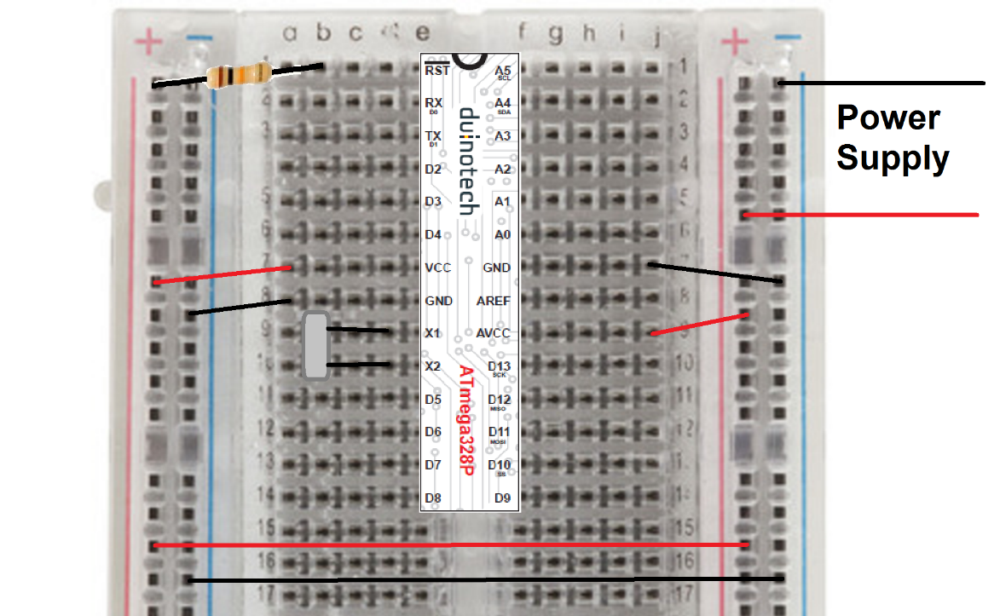
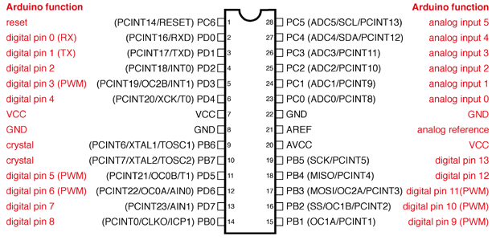
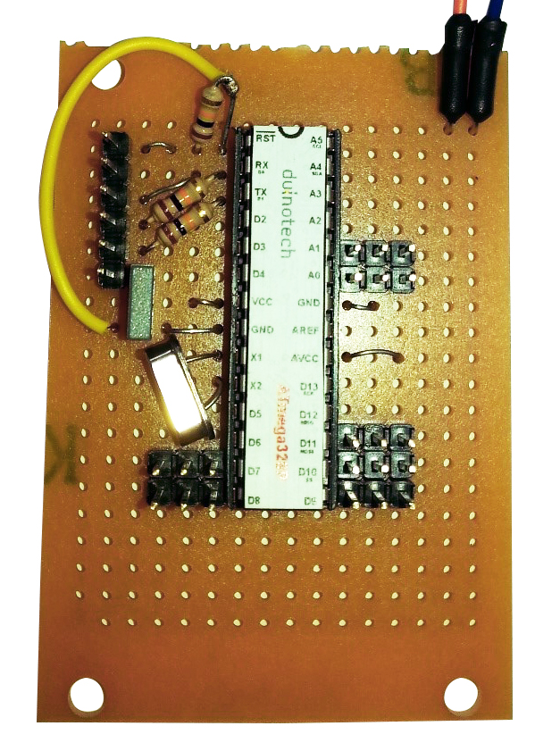
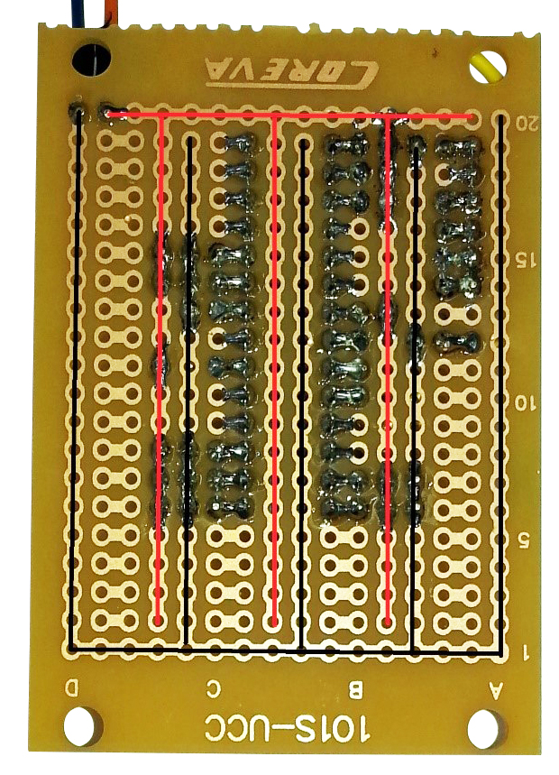
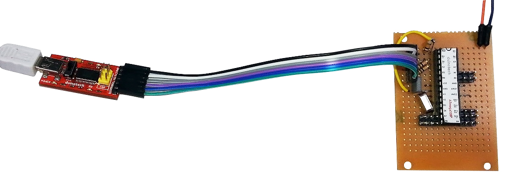
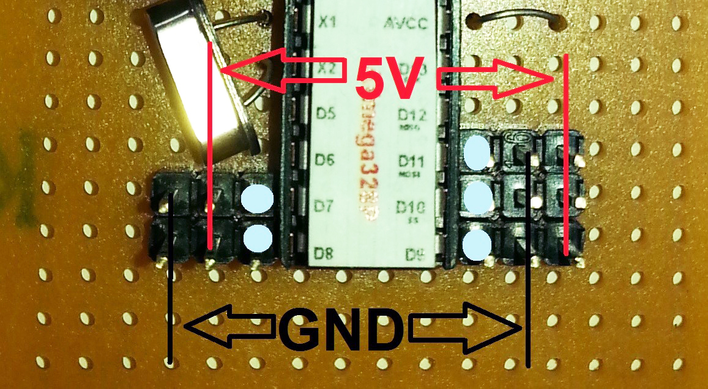
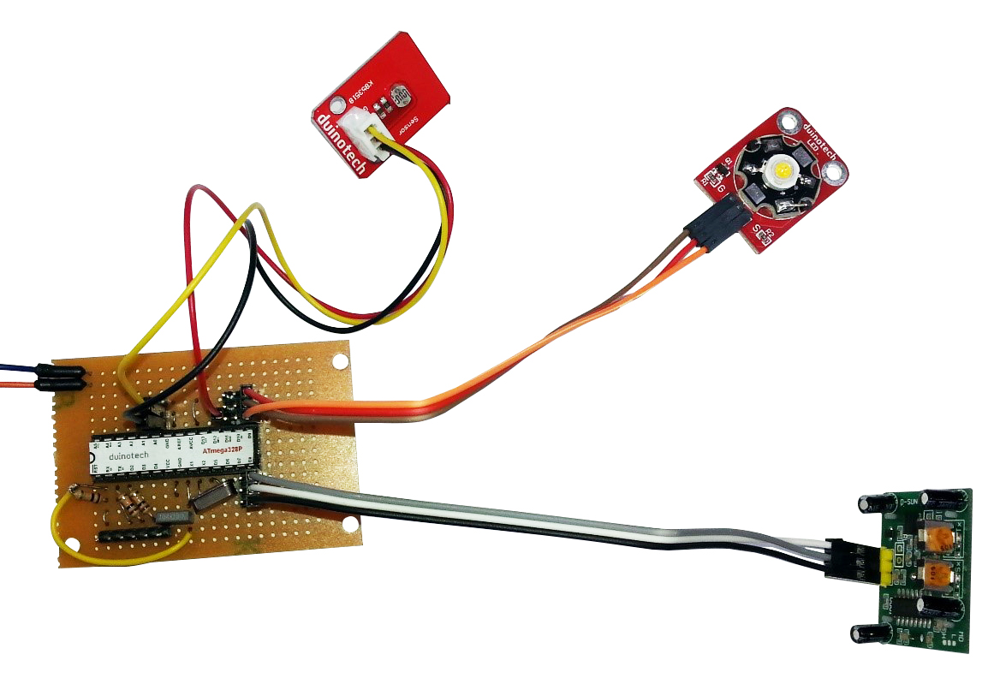
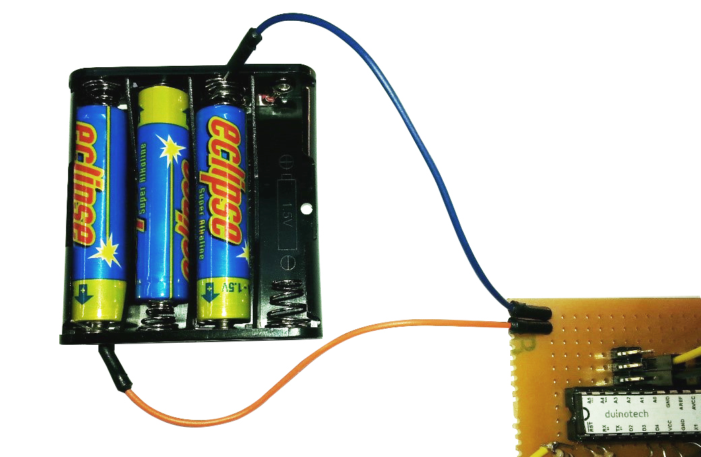

# Arduino Power Saving and Battery Night Light

The Arduino IDE and boards make it very easy to design and prototype a circuit, and even build a circuit to do something useful. But what if you've got a circuit you need to run off batteries? It turns out that part of the Arduino's flexibility also means it uses more power than a dedicated circuit might. In this article, we've give you a few ideas about how you can tweak your 'duino to use less power, and hopefully run longer. For most of the things we're going to show you, we're going to use the Uno running an 'empty' sketch, so you can easily try these experiments out for yourself on a bare Uno board. Of course an Arduino that does nothing isn't much use, but some of the software power reduction options will disable some functions- it's about what's going to work with your application.

If you want to estimate how long your project would last, you need to know the capacity of your batteries in mAh (milliamp-hours), and how many milliamps of current your project uses. For example, a project that uses 50mA running from a 2000mAh battery (typical for some NiMH rechargeables), it would be expected to run for 2000/50 or 40 hours. This is only an estimate, as all batteries and all circuits tend to vary slightly. If it's a critical application, it's probably worth testing.

## Connection:

The first place to look for power saving is in the hardware itself. Most Arduino boards have more features than you would usually use (at the same time). There's a few ways to work around this- either using the Arduino board differently, or building your own Arduino-compatible circuit.

You might remember from our [Powering Your Arduino](http://www.jaycar.com.au/lbc) article, that there are four ways to power you're an Uno. There's the VIN pin, DC jack, 5V pin and USB. If you're using batteries, you probably won't be using USB, and the VIN pin and DC jack are essentially the same as far as the Arduino is concerned. I did the following comparison of power supplies:

|Input |Power Source |Current
|---|---|---
|DC jack |7.5V - 5xAA batteries |47mA
|5V |4.5V - 3xAA batteries |37mA

We've used 5xAA batteries for the DC jack because the onboard regulator needs at least 7 volts, while the 5V pin is actually happy with anywhere between 4 and 5.5 volts. The 10mA difference is due to the fact that the voltage regulator needs to constantly use about 10mA to maintain its output. So just by using the 5V pin, we can approximately halve the number of batteries we'd need to use.

## Processor Speed:

There's actually a few options for power-saving that can be activated in software by running commands inside the sketch itself. By default, the ATMega 328P IC runs at 16MHz. If you have a sketch that doesn't need to spend all its time processing data, you might be able to run the processor slower, so it's not working as hard and using as much power. We do this by changing the prescaler, and the prescaler settings can be changed at any time, so even if you need spend some time processing data and some time waiting, you can change as necessary. These were the current usages we measured for a sketch that does nothing:

|Clock Prescaler |Current
|--- |---
|1(default) |37mA
|16 |30mA
|256(slowest) |29mA

The multiplier can be changed to any power of two between 1 and 256, and the code we used is below:

```c
#define CLOCK_PRESCALER_1   (0x0)
#define CLOCK_PRESCALER_2   (0x1)
#define CLOCK_PRESCALER_4   (0x2)
#define CLOCK_PRESCALER_8   (0x3)
#define CLOCK_PRESCALER_16  (0x4)
#define CLOCK_PRESCALER_32  (0x5)
#define CLOCK_PRESCALER_64  (0x6)
#define CLOCK_PRESCALER_128 (0x7)
#define CLOCK_PRESCALER_256 (0x8)

void setup() {
  uint8_t oldSREG = SREG;
  cli();

  CLKPR = _BV(CLKPCE);
  CLKPR = CLOCK_PRESCALER_256;

  SREG = oldSREG;
}

void loop() {

}
```

The #defines at the start are just to give the settings more useful names, and the code inside the setup() function is what sets the prescaler ratio. The value highlighted in yellow is what is changed to give different speeds- if you think of the prescaler as a divider, you can work out the actual processor speed, so with a prescaler of 16, the processor runs at 1MHz, and with a prescaler of 256, the processor runs at 62.5kHz.

Of course, with any saving comes a compromise, and as you might expect, things that depend on timing are the ones that are affected. Things like the serial port, timers and delay functions don't know that the speed has been changed and will operate slower than expected. The easiest way around this is to multiply the baud rate or divide the delay by the prescaler. For example, if you are using the serial port at 9600 baud with a prescaler of 1, that will appear the same as 38400 baud with a prescaler of 4. Or if you want to delay 1000ms while the prescaler is 8, you need to use delay(125).

Another issue that might occur is that if you are using ISP to program your Arduino is that it might not respond to the programmer if the prescaler is set too high. The easiest way to avoid this is to allow the Arduino to run at full processor speed (prescaler = 1) for a few seconds after reset, so that it can be manually reset if necessary to be at full speed for the upload. You can do this by simply adding delay(2000) to the start of your setup() routine.

## Hardware:

We found we weren't able to squeeze much more out of the Uno here, and the reason is that there are still a few things on the board that draw power. Even after bypassing the 5V regulator, the USB-serial converter, 3.3V regulator, and power LED are still running. If you're game, and don't think that you'll need them, you could remove them by desoldering (of course you won't be able to use them after this).

The alternative is to build an Arduino board up from scratch, only adding the things you need. The following breadboard circuit using a

[ZZ8727 ATMega 328P IC and 16MHz Crystal](https://jaycar.com.au/p/ZZ8727)
and a[10kOhm resistor](https://jaycar.com.au/p/RR0596)
is a good starting point:



You’ll also find instructions on programming the above board on the

[ZZ8727 page](https://jaycar.com.au/p/ZZ8727)
, but you will need either an[ISP Programmer](https://jaycar.com.au/p/XC4627)
or a[USB-Serial converter](https://jaycar.com.au/p/XC4464)
. Emulating the prescaler experiments from the last page, we were able to achieve the following:

|Clock Prescaler |Current
|--- |---
|1(default) |14mA
|16 |8mA
|256(slowest) |7mA

Note that we've saved about 22mA just by ditching the unused accessories on the Uno main board. Now that we have minimal hardware, we can look at software changes that will take power consumption even further.

## Software:

The software is what makes our Arduino do what we want, so you may not be able to apply all the following changes without disabling some function that you need. A bit more experimenting might be necessary.

Fortunately, the Arduino IDE comes with a library called <avr/power.h> that includes some easy ways to turn off some of the modules you may not be using. The following results use our blank sketch with a prescaler of 4, with various modules turned off:

|Modules |Current
|--- |---
|All enabled(default) |9.7mA
|ADC disabled |9.4mA
|SPI disabled |9.3mA
|UART disabled |9.4mA
|Timer0 disabled |9.6mA
|Timer1 disabled |9.6mA
|Timer2 disabled |9.6mA
|TWI disabled |9.6mA
|All disabled |9.1mA

To implement the above, include the power library by putting the following line at the very top of your sketch:

```c
#include <avr/power.h>
```

And put the following code in your setup (or wherever you'd like to disable modules):

```c
power_adc_disable(); // ADC
power_spi_disable(); // SPI
power_usart0_disable();// Serial
power_timer0_disable();// Timer0
power_timer1_disable();// Timer1
power_timer2_disable();// Timer2
power_twi_disable(); // TWI
```

Note that functions like millis() and delay() use Timer0, so these will not work correctly if Timer0 is disabled. There are corresponding enable functions, eg power_adc_enable(); if you want to re-enable the ADC module after disabling it

As you can see, the gains we are making are quite small now. The next step is to actually put the processor to sleep, so that it is practically doing nothing at all. This is quite easy, but we need to make sure that it can wake up again when we need it.

To use the sleep library, we include the following library:

```c  
#include <avr/sleep.h>
```

And then you can put the processor to sleep with the following sequence of commands:

```c
set_sleep_mode(SLEEP_MODE_IDLE);
sleep_enable();
sleep_cpu ();
```
The following modes are available (and documented in the ATMega 328P datasheet)

* SLEEP_MODE_IDLE
* SLEEP_MODE_ADC
* SLEEP_MODE_PWR_SAVE
* SLEEP_MODE_EXT_STANDBY
* SLEEP_MODE_STANDBY
* SLEEP_MODE_PWR_DOWN

Only the SLEEP_MODE_IDLE mode will allow the processor to automatically wake up:

```c
#include <avr/sleep.h>

void setup() {
}

void loop() {
  set_sleep_mode (SLEEP_MODE_IDLE);
  sleep_enable();
  sleep_cpu ();
  //put your code here
}
```

The SLEEP_MODE_IDLE mode does not disable the timers, so the processor will wake up every millisecond when the timer interrupt for the millis() function activates. Any code you need to run can be put at the bottom of the loop function and it will run about once a millisecond. Assuming we're using a prescaler of 1, this strategy takes our current from 14mA down to about 9mA, or from 10mA to 7mA with a prescaler of 4. The other sleep modes use even less power, but also need a way to waken the processor.

To do this, we need to use interrupts (the SLEEP_MODE_IDLE above actually works on the interrupt that the millis() function uses to update). Because we're shutting just about everything down, including the timers, things like millis() won't work at all. The watchdog timer runs independently of the main processor, and can be set for a delay from 16ms up to 8 seconds. Looking at the sketch below, we need the sleep and wdt libraries included at the top of the sketch, these are both included with the Arduino IDE. The defines just make it easier to specify the interval we want the processor to sleep for.

The ISR function routine is what gets activated when the watchdog timer goes off, and all we want it to do is de-activate the watchdog so it doesn't interfere with what we want to do while the processor is awake. The following sketch will blink an LED on pin 13 for four seconds on and four seconds off. Think of the wdtsleep() function as a low power delay that you can only assign certain values to.

```c
#include <avr/sleep.h>
#include <avr/wdt.h>

#define WDT16MS (0)
#define WDT32MS (1)
#define WDT64MS (2)
#define WDT125MS (3)
#define WDT250MS (4)
#define WDT500MS (5)
#define WDT1S (6)
#define WDT2S (7)
#define WDT4S (32)
#define WDT8S (33)

ISR (WDT_vect) {wdt_disable();}

void setup(){
  pinMode(13,OUTPUT);
}

void wdtsleep(){
  WDTCSR=_BV(WDCE)|_BV(WDE);
  WDTCSR=_BV(WDIE)| WDT4S;

  wdt_reset();
  set_sleep_mode (SLEEP_MODE_PWR_DOWN);
  sleep_enable();
  sleep_cpu ();
}

void loop() {
  wdtsleep();
  digitalWrite(13,HIGH);
  wdtsleep();
  digitalWrite(13,LOW);
}
```

With our ammeter on this circuit (and the LED disconnected), we were getting readings of about 0.2mA. That's heaps less power, but only of use if you need the processor to do practically nothing most of the time.

It may not look like much, but in the brief periods when the processor is awake, it can check its inputs and respond. The following project will show how we can use these techniques to build something practical that can run for an extended period on batteries. It's a motion activated nightlight, that only comes on when it’s dark. The standby current is less than a milliamp, which will be enough to run it for months. There is some soldering required, as we are pretty much going to build our own Arduino compatible board.

## Shopping List:

|Qty| Code | Description |
|---|---|---|
|1 | [ZZ8727](http://jaycar.com.au/p/ZZ8727) | Atmega 328P with crystal
|1 | [HP9556](http://jaycar.com.au/p/HP9556) | Ultra mini experimenters board
|1 | [PI6510](http://jaycar.com.au/p/PI6510) | 28 pin IC socket
|1 | [XC4444](http://jaycar.com.au/p/XC4444) | PIR motion detection
|1 | [XC4446](http://jaycar.com.au/p/XC4446) | LDR sensor
|1 | [XC4468](http://jaycar.com.au/p/XC4468) | High powered LED module
|1 | [RR0596](http://jaycar.com.au/p/RR0596) | 10Kohm resistor pack
|1 | [WC6026](http://jaycar.com.au/p/WC6026) | socket socket jumper leads
|1 | [HM3212](http://jaycar.com.au/p/HM3212) | header strip
|1 | [RM7125](http://jaycar.com.au/p/RM7125) | 100nF poly cap
|1 | [PH9268](http://jaycar.com.au/p/PH9268) | 4 AAA battery holder

You’ll also need a

USB-Serial converter like [XC4466](https://jaycar.com.au/p/XC4464) to program the completed board. An alternative if you don’t have one of these is to temporarily take the IC out of a UNO [XC4410](https://jaycar.com.au/p/XC4410) and use that as a programmer.

## Construction:

As a guide, the RST pin is number 1, and the pin numbers increase in an anti-clockwise direction. The notch at one end might also help to orient you. See the diagram below:



From: [https://www.arduino.cc/en/Hacking/PinMapping168](https://www.arduino.cc/en/Hacking/PinMapping168)

A good way to start construction is to solder the IC socket onto the Experimenter's board, and then follow the table below to see what has to be connected to what. Note that the pin numbers of the IC are not the same as the Arduino pin names- both are given below.  Where a direct connection is needed, we've just use the cut-off legs of resistors, but any wire should be fine. You could use some of the jumper leads if necessary.

|ATMega IC pin |Connection
|--- |---
|Pin 1: RST |Connect to 5V via 10kOhm resistor
|Pin 2: RX |Connect to header pin 4 via 10kOhm resistor
|Pin 3: TX |Connect to header pin 5 via 10kOhm resistor
|Pin 7: VCC |Connect to 5V
|Pin 8: GND |Connect to GND
|Pin 9: X1 |Connect to one leg of 16MHz Crystal
|Pin 10: X2 |Connect to one leg of 16MHz Crystal
|Pin 20: AVCC |Connect to 5V
|Pin 22: GND |Connect to GND

We also need a six pin header for the USB-Serial converter. You might have already made the connections to RX and TX from the table above.

|USB-Serial |Connection
|--- |---
|Pin 1: GND |Connect to GND
|Pin 2: CTS |No connection
|Pin 3: 5V |Connect to 5V
|Pin 4: TX |Connect to IC pin 2(RX) via 10kOhm resistor
|Pin 5: RX |Connect to IC pin 3(TX) via 10kOhm resistor
|Pin 6: DTR |Connect to IC pin 1(RST) via 100nF capacitor

And here are some photos of the top and bottom of the assembled circuit board. Note that the pattern of 5V and GND traces is not symmetrical, and unless you follow the photos exactly, the position of your jumpers may be different. We've traced out the ground and 5V paths in black and red to make them easier to follow. Note that it's the black ground path that goes along the bottom of the board closest to the letters, and also around the outside.





Note the small 3-pin sections of header strip that have been soldered adjacent to some of the pins- this will allow us to add our modules later. Don't connect the batteries yet, as the board can get power from the USB-Serial Converter during programming.

Now connect the USB-Serial converter using a group of six socket-socket jumper leads, and plug it into your computer. The pins are the same order on both headers, so if you make sure GND goes to GND and all the other wires are in order, it should be fine.



You should now be able to program the board as though it's an Uno, using the serial port of the USB-Serial converter. There's no modules connected, so we can't make it do much yet, although you could try programming it with a sketch to see if it can be programmed correctly. The headers have connections as per the diagram below. Double check the wiring for each sensor, as the headers are different on each side. The A0 and A1 headers will be the same as D9, D10 and D11 (with GND in the middle).



Connect the modules as:

* PIR module: GND to GND, VCC to 5V and OUT to D8
* LED module: G to GND, + to 5V and S to D9
* LDR module: GND to GND, VCC to D11 and OUT to A0.

The connection of VCC to D11 instead of 5V is not a mistake, but allows us to turn off the sensor (the LDR could use up to 0.5mA if it was permanently connected) while we're not using it. This is another trick you can use to save power. Generally, the ATMega 328P pins can supply up to 40mA, so if you have a peripheral that uses less than this, you can actually power it from a pin, and switch it off when it's not being used. We haven't done the same with the PIR because it doesn't use much power as the LDR.



Now that it's all set up, you can program the board and test that it works. If you cover the LDR module and wave your other hand in front of the PIR, the LED should come on after a few seconds. If you then uncover the LDR the light will blink and then go out. If it doesn't do this, check your wiring, especially around the modules. If the board doesn't even program, then check that the connections around the USB-Serial converter are correct.

If you don't have a USB-Serial converter and want to use an Uno to program the ATMega 328P, carefully remove the IC by prying it up squarely at each end (you don't want to bend the pins). Then place the IC to be programmed in, making sure the notches at the end of the IC line up with the notch marks on the board and socket. Then program the board as you would normally, and disconnect it from the computer and remove the IC and place it on the board we've made. The disadvantage to this method is that you can't do in circuit testing if there is a code problem.

The final step is to connect the board to a battery supply. We've cut the leads off a 4xAAA battery holder, and made the connections to the wires coming from the boards to run only three AAA batteries- the ATMega 328P can only handle a maximum of 5.5V, and four batteries will give over 6V when they are new. Of the four battery slots, we've used all but the one where the red lead used to run (any other way won't give you a proper circuit).



This completes our low power night light. Of course, the board we’ve made doesn’t need to be used for low power situations. The three–pin headers are suited to experimenting with modules, and if you leave the USB-Serial converter connected, it’s almost the same as an Uno as far as the Arduino IDE is concerned.

## Code:

The code is in this git repo if you need to change the allocated pins, the #defines are set just after the ISR routine. The sensitivity of the LDR module is set by the LDRTHRESHOLD #define (decrease this if the light is coming on when it's too bright). The PIR sensitivity can be set by the potentiometer marked Sx on the PIR module- clockwise is more sensitive.
